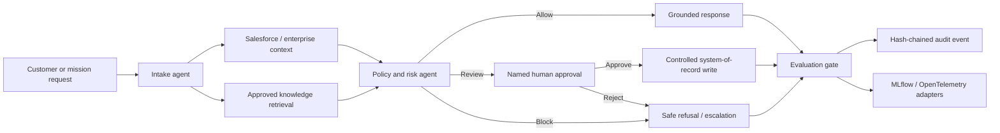

# Enterprise Agent Foundry

[](https://www.python.org/)
[](LICENSE)

A public, runnable reference implementation for designing, evaluating, governing, and operating **enterprise agentic AI systems**. The flagship scenario combines approved-knowledge retrieval, agent orchestration, Salesforce-ready integration, attributable human approval, deterministic evaluation, adversarial testing, traceability, and tamper-evident audit logging.

The repository is designed to demonstrate the work expected of a **Lead/Principal AI Forward-Deployed Engineer** and a **Federal AI Architect** without exposing employer, customer, student, government, or proprietary data.

> **Truth-in-engineering:** The default runtime uses synthetic data and a deterministic grounded-response provider. Optional LLM, vector, MLOps, distributed-data, cloud, and agent-framework packages are labeled as implemented, optional, or planned. Synthetic benchmark results validate this repository’s workflow—not real-world model quality, production scale, or platform tenure.

> **Repository transition:** The public repository slug remains `forward-deployed-ai-lab` until the GitHub repository is renamed. The product and portfolio identity is now **Enterprise Agent Foundry**.

## What a reviewer can verify

- A multi-stage workflow: **intake → enterprise context → retrieval → policy → response/action proposal → approval → evaluation → audit**
- BM25 retrieval over approved synthetic knowledge with role filtering and source citations
- Prompt-injection, secret-exfiltration, data-minimization, and destructive-action controls
- Human-review routing for Salesforce Case updates, closures, escalations, and refund proposals
- Salesforce REST integration with a safe synthetic system-of-record fallback
- Hash-chained, append-only JSONL audit events with secret redaction
- Golden-set and adversarial release gates that run without API keys
- FastAPI/OpenAPI, browser demo, Replit, Dev Container/Codespaces, Docker, Kubernetes, GitHub Actions, GitLab CI, Dependabot, and dependency-audit configurations
- Optional LangGraph, MLflow, PySpark/Databricks, vector-store, cloud, and provider extension paths

## Ten-minute recruiter path

1. Review this README and the architecture below.
2. Run `make install verify-repo lint typecheck test evaluate red-team`.
3. Start the demo with `make run`.
4. Open `http://localhost:3000` and `http://localhost:3000/docs`.
5. Inspect the checked-in evaluation and red-team artifacts.

## Quick start

```bash
python -m venv .venv
source .venv/bin/activate                 # Windows: .venv\Scripts\activate
python -m pip install --upgrade pip
pip install -e ".[dev]"

make verify-repo
make lint typecheck test evaluate red-team
make run
```

No API key is required for the default path.

## Architecture



The default orchestrator is framework-neutral and fully testable. Framework adapters must preserve the same domain contract, authority boundary, synthetic scenario, evaluation dataset, and audit schema. This makes framework comparisons meaningful instead of creating unrelated demo applications.

## Framework strategy

| Priority | Framework or platform | Portfolio purpose | Status |
|---:|---|---|---|
| 1 | Salesforce REST + Agentforce SDK | Direct evidence for Salesforce JR346211 | REST implemented; Agentforce vertical planned |
| 2 | LangGraph | Durable state, checkpointing, interrupts, and HITL | Optional adapter implemented; persistence proof planned |
| 3 | OpenAI Agents SDK | Tools, handoffs, guardrails, tracing, MCP, and HITL | Shared-scenario adapter planned |
| 4 | Microsoft Agent Framework | Production workflows, telemetry, checkpointing, and HITL | Shared-scenario adapter planned |
| 5 | Google ADK | Provider/cloud portability, evaluation, MCP/A2A | Later comparison lane |
| Comparison | CrewAI, AutoGen, Semantic Kernel | Bounded comparison or migration evidence | Optional only |

## Salesforce integration

The Salesforce connector supports:

- SOQL queries through the Salesforce REST API
- Synthetic Account and Case context for credential-free demonstrations
- Approval-controlled Case update proposals
- Explicit separation of read access, proposal generation, approval, and execution
- Live-write protection through both `FDAI_LIVE_INTEGRATIONS_ENABLED=true` and `FDAI_ALLOW_SALESFORCE_WRITES=true`

The next Salesforce milestone adds a Developer Edition or Trailhead Playground, modular Agentforce definitions, prompt templates with Salesforce field mappings, validation-first deployment, an MCP example, and a manually gated live-org smoke test. No production Agentforce experience is claimed until that evidence exists.

## Evaluation evidence

The current synthetic evidence includes:

- **10/10** golden-set scenarios passing
- **8/8** adversarial scenarios passing
- **30** automated tests passing
- **88.43%** measured branch coverage with an enforced 80% minimum
- Coverage of at least **80%** enforced under documented exclusions

These results validate routing, controls, retrieval, approvals, and evaluation behavior on included synthetic datasets. They are not production-scale claims.

## Portfolio roadmap

This repository is the flagship project in a broader evidence-first portfolio strategy:

1. **Enterprise Agent Foundry** — end-to-end forward-deployed AI system
2. **AI Evaluation Framework** — extract only after it has independent users and release cadence
3. **AI Reference Architectures** — cloud, federal, and enterprise deployment blueprints
4. **Federal AI Patterns** — secure and governed patterns for regulated environments
5. **Enterprise RAG Patterns** — retrieval, evaluation, and observability comparisons

The flagship repository is being matured first so future repositories are extracted from working, independently useful components rather than created as empty placeholders.

## Security and responsible AI

- Synthetic data only
- Least-privilege role filtering
- No autonomous destructive actions
- Explicit human approval for consequential writes
- Prompt-injection and secret-exfiltration tests
- Secret redaction before audit persistence
- Hash chaining for tamper evidence
- Container and Kubernetes hardening examples
- NIST AI RMF-aligned governance concepts

This repository demonstrates engineering controls. It does not claim FedRAMP, DoD, SOC 2, NIST, or Salesforce certification.

## Role alignment

### Salesforce JR346211 — AI Forward-Deployed Engineer

- Converts an enterprise customer problem into a working AI workflow
- Integrates approved knowledge and Salesforce-style systems of record
- Demonstrates Python engineering, agentic orchestration, evaluation, and delivery
- Provides an approval-controlled path for consequential actions
- Includes recruiter-accessible documentation, API, tests, and CI

### VTG — AI Architect

- Covers agentic AI, RAG, provider adapters, autonomous/semi-autonomous workflows, evaluation, red teaming, hallucination controls, MLOps, governance, Spark/Databricks, cloud, containers, Kubernetes, and executive architecture artifacts
- Separates fully implemented capabilities from optional adapters and planned extensions
- Uses synthetic data so the design can be discussed publicly in federal and regulated-environment interviews

## Release plan

- **v0.4.0:** research-backed public foundation, validated synthetic workflow, governance, CI, and evidence model
- **v1.0.0-rc.1:** release candidate with packaged runtime assets, clean-install artifact tests, replay-safe approvals, bounded Salesforce retries, SBOM, checksums, provenance, and release assets
- **v1.0.0:** tag only after every release-candidate CI and security check is green
- **v1.1:** durable LangGraph state, approval persistence, and framework comparison
- **v1.2:** Spark, Databricks, MLflow, and large-data evaluation
- **v1.3:** Azure, AWS, and Google Cloud deployment blueprints
- **v1.4:** Agentforce, MCP, and OpenTelemetry integration evidence

## License

MIT. See [LICENSE](LICENSE).
