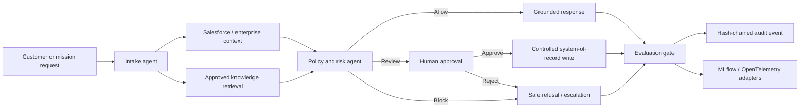

# Forward-Deployed AI Delivery Lab

[](https://www.python.org/)
[](LICENSE)

A public, runnable reference implementation of a **forward-deployed enterprise AI workflow**: approved-knowledge retrieval, agent orchestration, policy guardrails, Salesforce-ready integration, human approval, deterministic evaluation, red-team testing, traceability, and tamper-evident audit logging.

The project is designed to demonstrate the engineering and architecture expected of a **Lead/Principal AI Forward-Deployed Engineer** and a **Federal AI Architect** without exposing employer, customer, student, government, or proprietary data.

> **Truth-in-engineering statement:** The default runtime uses synthetic data and a deterministic grounded-response provider. Optional LLM, vector, MLOps, big-data, and cloud packages are clearly labeled as implemented adapters, extension points, or future production choices. Synthetic benchmark results validate this repository's workflow—not real-world model quality or production scale.

## What a reviewer can verify

- A multi-stage enterprise workflow: **intake → enterprise context → retrieval → policy → response → evaluation → audit**
- BM25 retrieval over approved synthetic knowledge, with source citations and role filtering
- Prompt-injection, secret-exfiltration, data-minimization, and destructive-action controls
- Human-review routing for Salesforce Case updates, closures, escalations, and refund proposals
- A real Salesforce REST adapter plus a safe synthetic system-of-record fallback
- A hash-chained, append-only JSONL audit trail with secret redaction
- Golden-set and adversarial evaluation gates that run without API keys
- FastAPI/OpenAPI endpoints, a browser demo, Replit configuration, Docker, Kubernetes, GitHub Actions, GitLab CI, Dependabot, and a scheduled dependency audit
- Optional LangGraph interrupts/checkpointing, MLflow tracking, PySpark/Databricks ingestion, vector databases, and cloud AI platform extensions

## Ten-minute recruiter path

1. Read [the recruiter guide](docs/recruiter-guide.md).
2. Review the architecture diagram below and [detailed design](docs/architecture.md).
3. Run `make install test evaluate red-team`.
4. Start the browser demo with `make run` and open `http://localhost:3000`.
5. Inspect `artifacts/evaluation-report.json`, `artifacts/red-team-report.json`, and the API docs at `http://localhost:3000/docs`.

## Quick start

```bash
python -m venv .venv
source .venv/bin/activate                 # Windows: .venv\Scripts\activate
python -m pip install --upgrade pip
pip install -e ".[dev]"

pytest
python scripts/evaluate.py
python scripts/red_team.py
python -m forward_deployed_ai_lab
```

No API key is required for the default path.

### Docker

```bash
cp .env.example .env

docker compose up --build
```

### Replit

Import the repository into Replit and run it from the repository root. The included `.replit` file starts the FastAPI application on port 3000.

## Architecture



The default orchestrator is framework-neutral and fully testable. An optional LangGraph adapter demonstrates persisted thread state and human interrupts without making the core runtime dependent on one orchestration vendor.

## Project structure

The layout incorporates the attached AI-agent project pattern while using a production-friendly Python `src/` package:

```text
forward-deployed-ai-lab/
├── README.md                       # Project overview, evidence, and run path
├── pyproject.toml                  # Core and optional dependency groups
├── requirements.txt               # Lean runtime dependencies
├── requirements-architect.txt     # VTG/Navy AI Architect technology set
├── .env.example                    # Environment variables; no live secrets
├── Dockerfile
├── docker-compose.yml
├── main.py                         # Replit/local entry point
├── src/forward_deployed_ai_lab/
│   ├── agents/                     # State, registry, orchestrator, LangGraph adapter
│   ├── tools/                      # Retrieval, policy, approval, Salesforce, vectors
│   ├── models/                     # Domain schemas and model-provider adapters
│   ├── prompts/                    # Versioned system prompts
│   ├── api/                        # FastAPI routers and schemas
│   ├── evaluation/                 # Golden set, metrics, red team, MLflow adapter
│   ├── observability/              # Stage tracing and hash-chained audit events
│   ├── pipelines/                  # PySpark/Databricks-ready ingestion example
│   ├── integrations/               # Honest package/integration capability catalog
│   └── utils/                      # IDs, tokenization, and secret redaction
├── tests/                          # Unit, integration, API, governance, and eval tests
├── data/                           # Synthetic knowledge, cases, golden sets, attacks
├── web/                            # Browser demo
├── notebooks/                      # Evaluation walkthrough
├── infra/                          # Kubernetes and cloud deployment guidance
├── artifacts/                      # Reproducible benchmark reports
└── logs/                           # Local audit logs, ignored by Git
```

## API examples

### Read-only grounded request

```bash
curl -s http://localhost:3000/api/v1/assist \
  -H 'Content-Type: application/json' \
  -d '{
    "query": "What is the response target for a Priority 1 incident?",
    "requested_action": "read"
  }'
```

### Approval-controlled Salesforce case proposal

```bash
curl -s http://localhost:3000/api/v1/assist \
  -H 'Content-Type: application/json' \
  -d '{
    "query": "Close the case after documenting the resolution.",
    "case_id": "500000000000001",
    "requested_action": "close_case"
  }'
```

The second request creates an approval record and proposed action. It does **not** execute the write.

## Salesforce integration

The connector in `tools/salesforce.py` supports:

- SOQL query calls through Salesforce REST API
- Synthetic Account/Case context for credential-free demonstrations
- Approval-controlled Case update proposals
- Explicit separation of read access, proposal generation, approval, and execution
- Live-write protection through both `FDAI_LIVE_INTEGRATIONS_ENABLED=true` and `FDAI_ALLOW_SALESFORCE_WRITES=true`

Use a Salesforce Developer Edition or Trailhead Playground with a Connected App and least-privilege OAuth configuration. Never commit access or refresh tokens.

## AI Architect technology map

The repository includes the tools named in the VTG/Navy AI Architect description without pretending every framework is the primary runtime.

| Capability | Technology | Repository status |
|---|---|---|
| Primary language / notebooks | Python, Jupyter | Implemented / walkthrough notebook |
| Agent orchestration | LangGraph | Optional working adapter |
| Alternative orchestration | LangChain, Semantic Kernel, CrewAI, AutoGen, OpenAI Agents SDK | Dependency groups and documented adapter path |
| RAG / vectors | BM25, Chroma, Qdrant, FAISS, sentence-transformers | BM25 implemented; Chroma/Qdrant adapters; others optional |
| Evaluation | Deterministic metrics, RAGAS, DeepEval, garak | Deterministic gate implemented; external frameworks optional |
| Traditional ML / explainability | scikit-learn, Fairlearn, SHAP, Evidently | Evaluation extension group |
| Deep learning / NLP | TensorFlow, PyTorch, Hugging Face | Model-development extension group |
| MLOps | MLflow, CI/CD, Docker, Kubernetes | MLflow adapter; delivery assets implemented |
| Big data | Apache Spark, Databricks, Delta | PySpark silver-layer example; SDK optional |
| Cloud AI | Azure AI/ML, AWS SageMaker/Bedrock, Google Vertex AI | Deployment extension group and architecture guidance |
| Observability | Hash-chained audit, OpenTelemetry, Prometheus | Audit implemented; telemetry exporters optional |
| Enterprise integration | Salesforce REST API | Implemented with synthetic and live modes |

See [technology-matrix.md](docs/technology-matrix.md) for evidence paths and non-claims.

Architecture tradeoffs are recorded in [the ADR index](docs/adr/README.md). See the [validation report](docs/validation-report.md), [demo script](docs/demo-script.md), and [publishing guide](docs/publishing.md) for review and release steps.

## Evaluation

```bash
python scripts/evaluate.py
python scripts/red_team.py
```

### Checked-in synthetic evidence

The current reproducible artifacts contain **10/10 golden-set cases passing** and **8/8 adversarial cases passing**. The local validation suite currently includes **21 passing tests** with **86.94% measured coverage** under the documented exclusions. These results validate routing, controls, retrieval, approvals, and evaluation behavior on the included synthetic datasets; they are not production-scale model claims.

The benchmark measures:

- Policy decision accuracy
- Requested-action routing accuracy
- Human-approval routing accuracy
- Retrieval hit rate
- Groundedness proxy
- Citation coverage
- Median local workflow latency

RAGAS and DeepEval are optional because their LLM-judge metrics may require model credentials and incur cost. The default gate remains deterministic and reproducible in CI.

## Security and responsible AI

- Synthetic data only
- Least-privilege role filtering
- No autonomous destructive actions
- Explicit human approval for consequential writes
- Prompt-injection and secret-exfiltration tests
- Secret redaction before audit persistence
- Hash chaining for tamper evidence
- Container and Kubernetes hardening examples
- NIST AI RMF-aligned governance, mapping, measurement, and management concepts

This repository demonstrates engineering controls; it does not claim FedRAMP, DoD, SOC 2, NIST, or Salesforce certification.

## Role alignment

### Salesforce JR346211 — AI Forward-Deployed Engineer

- Converts an enterprise customer problem into a working AI workflow
- Integrates knowledge and Salesforce-style systems of record
- Demonstrates hands-on Python engineering, agentic orchestration, evaluation, and delivery
- Provides an approval-controlled path for consequential actions
- Includes recruiter-accessible documentation, browser demo, API, tests, and CI

### VTG — AI Architect

- Covers agentic AI, RAG, LLM adapters, autonomous/semi-autonomous workflows, evaluation, red teaming, hallucination controls, MLOps, governance, Spark/Databricks, cloud, containers, Kubernetes, and executive architecture artifacts
- Separates what is fully implemented from optional provider and platform extensions
- Uses synthetic data so the design can be discussed publicly in federal and regulated-environment interviews

## Research basis

The design is grounded in official project documentation and reference implementations from LangGraph, OpenAI Agents SDK, Microsoft Semantic Kernel, FastAPI, Pydantic, MLflow, RAGAS, Docker, GitHub Actions, NIST, and Salesforce. See [research-basis.md](docs/research-basis.md).

## License

MIT. See [LICENSE](LICENSE).
