# Architecture

## Design goal

Demonstrate how a forward-deployed engineer can turn an ambiguous customer request into a governed, observable, testable enterprise AI workflow. The default implementation favors transparency and reproducibility over model novelty.

## Logical components

1. **API and browser delivery layer** — FastAPI routers and a lightweight UI.
2. **Intake and state** — typed request schemas, trace ID, role, case context, and action intent.
3. **Enterprise connector** — a Salesforce REST adapter with a synthetic fallback.
4. **Knowledge retrieval** — approved documents, role filtering, BM25 ranking, and vector extension points.
5. **Policy engine** — deterministic prompt-injection, secret, data, and action controls.
6. **Response provider** — deterministic provider by default; OpenAI/Anthropic adapters are optional.
7. **Human approval** — proposed writes remain pending until a named reviewer approves them.
8. **Evaluation** — deterministic metrics, golden sets, red-team cases, and optional RAGAS/DeepEval/MLflow.
9. **Observability** — stage timings and a secret-redacted, hash-chained audit log.
10. **Deployment** — Replit, Docker, GitHub Actions, GitLab CI, Kubernetes, and cloud extension guidance.

## Trust boundaries

```mermaid
flowchart TB
  subgraph Untrusted
    U[User input]
    D[Retrieved document text]
  end
  subgraph Controlled runtime
    V[Schema validation]
    P[Policy engine]
    R[Retriever]
    M[Model provider]
    E[Evaluation]
    A[Audit]
  end
  subgraph Human authority
    H[Named reviewer]
  end
  subgraph External systems
    SF[Salesforce]
    C[Cloud model endpoint]
    O[Telemetry backend]
  end

  U --> V --> R
  D --> R --> P
  P --> M --> E --> A
  P --> H
  H --> SF
  M -. optional .-> C
  A -. optional .-> O
```

Retrieved text is treated as data, not as trusted instructions. The policy engine runs before a consequential action and is rechecked at execution. The public runtime keeps writes synthetic unless live integrations and write authorization are both explicitly enabled.

## Human-in-the-loop model

The framework-neutral runtime creates a pending approval artifact containing:

- trace ID
- action type and target
- proposed fields
- rationale
- timestamp
- reviewer identity and decision
- a SHA256 binding to the exact proposed action
- a deterministic idempotency key and execution status

Successful execution results are replayed without issuing a second write. Failed transient executions may be retried with the same action-bound idempotency key. The optional LangGraph adapter demonstrates `interrupt()` and an in-memory checkpointer. Production use must replace in-memory state with durable transactional storage, connect approval identity to enterprise SSO, and propagate an idempotency contract to downstream systems.

## Persistence and memory

- **Short-term workflow state:** request and response state; optional LangGraph checkpointer.
- **Long-term enterprise data:** Salesforce or another system of record.
- **Knowledge:** approved document store; BM25 locally, vector DB in production.
- **Audit:** append-only hash-chained JSONL locally; immutable object storage/SIEM in production.

## Scale path

- Replace in-process approvals with PostgreSQL plus transactional outbox.
- Replace local BM25 with hybrid lexical/vector search.
- Add asynchronous workers for long-running tool calls and evaluations.
- Export OpenTelemetry traces and metrics.
- Add model routing, fallbacks, rate limits, and cost budgets.
- Deploy on Kubernetes or a managed container platform.
- Run Spark/Databricks ingestion for high-volume enterprise knowledge preparation.
- Use workload identity and secret managers for cloud and Salesforce credentials.
