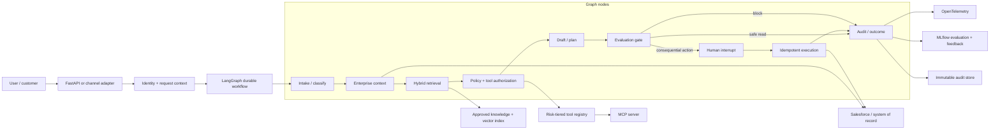

# Justin Silas AI Engineering Portfolio — Deep Research Report

**Research and implementation date:** 2026-07-15  
**Flagship repository:** `silasj1022/forward-deployed-ai-lab`  
**Target roles:** Salesforce AI Forward-Deployed Engineer (Lead/Principal), Federal/DoD AI Architect, Principal AI Platform Architect  

> This report separates verified implementation evidence from planned platform work. All benchmark results cited here use synthetic data and credential-free deterministic evaluation unless explicitly labeled otherwise.

## Executive conclusion

The strongest portfolio strategy is not to demonstrate the greatest number of agent frameworks. It is to demonstrate that one governed enterprise workflow can be:

1. translated from an ambiguous customer or mission problem into explicit requirements;
2. implemented with typed tools, state, and authority boundaries;
3. paused and resumed safely around consequential actions;
4. integrated with a real system of record;
5. evaluated with versioned datasets and release gates;
6. observed, secured, deployed, and explained to executive stakeholders; and
7. reproduced by an independent reviewer without proprietary data or paid credentials.

The current repository already has a credible offline reference implementation. The research indicates that the next principal-level proof points should be:

- a **real, stage-level LangGraph runtime** with durable persistence and resumable approvals;
- a **Salesforce-native Agentforce DX example** using Agent Script, an agent runtime user, permission sets, and representative actions;
- a **risk-tiered tool registry and MCP interface** rather than hard-coded action checks alone;
- a deeper **evaluation-driven development** loop with tool, goal, retrieval, safety, latency, reliability, and human-feedback metrics;
- **OpenTelemetry/MLflow evidence**, not only local JSON traces;
- a hardened **software supply chain** with CodeQL, dependency review, SBOMs, and release provenance; and
- a concise recruiter-facing README backed by a documentation site, demo recording, architecture decisions, and reproducible evidence.

## Research method

The review prioritized current, primary sources: official documentation, specifications, and maintained reference repositories from Salesforce, OpenAI, LangChain/LangGraph, Microsoft, CrewAI, LlamaIndex, MLflow, Ragas, OpenTelemetry, MCP, NIST, OWASP, GitHub, Docker, and SLSA. Social-media templates were treated as inspiration only, not engineering authority.

## What mature agent implementations converge on

### 1. Keep the domain core independent from the orchestration vendor

LangGraph describes itself as a low-level runtime for long-running, stateful agents and emphasizes persistence, durable execution, streaming, and human oversight. Its application guidance separates graph construction, state, nodes, tools, configuration, dependencies, and environment variables. OpenAI's Agents SDK takes a different, intentionally small-primitives approach—agents, tools, handoffs, guardrails, sessions, human approvals, and tracing—but reaches the same architectural conclusion: tools and authority should be explicit rather than hidden inside one prompt.

**Implication for this repository:** retain the typed, framework-neutral domain layer, but replace the current one-node LangGraph wrapper with an actual graph whose nodes correspond to intake, identity/context, retrieval, policy, drafting, evaluation, approval, execution, and audit.

### 2. Use deterministic workflow control where the business rule is known

Salesforce Agent Script explicitly combines natural-language reasoning with programmatic variables, conditions, transitions, and action sequencing so that enterprise workflows do not depend solely on LLM interpretation. CrewAI similarly distinguishes structured, stateful Flows from autonomous Crews. Semantic Kernel exposes named orchestration patterns—sequential, concurrent, handoff, group-chat, and Magentic—rather than treating every problem as an unconstrained conversation.

**Implication:** policy decisions, authorization, money movement, record mutation, and workflow transitions should be code or policy decisions. The model can classify, summarize, draft, retrieve, and propose; it should not silently define its own authority.

### 3. Human approval is a persisted workflow state, not a UI modal

LangGraph interrupts require a checkpointer and stable thread identifier; when resumed, nodes can restart, so side effects before the interrupt must be idempotent. OpenAI's Agents SDK similarly serializes run state, surfaces pending tool approvals, and resumes after approve/reject decisions. Both approaches treat long-running approvals as data with identity, version, and state.

**Implication:** replace the in-memory approval dictionary with durable storage, optimistic concurrency, immutable decision history, stable action IDs, idempotency keys, and a transactional outbox. Approval must bind the reviewer, exact tool call, exact arguments, policy version, and artifact version that were reviewed.

### 4. Tool design and tool governance are the center of enterprise agents

OpenAI's SDK treats tools, tool guardrails, handoffs, and MCP as first-class primitives. MCP standardizes how applications expose tools, resources, and prompts, while emphasizing explicit consent and safety around tool execution. Salesforce's Agentforce DX sample demonstrates actions implemented through Invocable Apex, Prompt Templates, and Flow, with a dedicated runtime identity and permission sets.

**Implication:** create a tool registry containing name, schema, owner, data classification, required role, risk tier, approval rule, timeout, retry policy, idempotency behavior, and audit fields. Expose safe read/propose/execute operations through MCP, with execution tools deny-by-default.

### 5. Evaluation must cover the full trajectory, not just the final answer

MLflow frames modern agent development as evaluation-driven development built around datasets, human feedback, automated judges, systematic evaluation, tracing, and production monitoring. Ragas includes retrieval metrics and agent-specific metrics such as tool-call accuracy and goal accuracy. OpenAI and LangGraph both emphasize tracing because final-answer scoring alone cannot reveal a bad tool choice, unsafe argument, repeated call, or approval bypass.

**Implication:** retain deterministic tests as the blocking baseline, then add optional model-based scorers. Evaluate:

- intent and requested-action classification;
- retrieval precision, recall, and source eligibility;
- groundedness and citation support;
- tool selection and argument correctness;
- goal completion and policy compliance;
- approval routing and bypass resistance;
- refusal precision and false-block rate;
- latency, token use, cost, retry count, and fallback behavior;
- trace completeness and audit integrity;
- robustness under prompt injection, poisoned retrieval, malformed tools, rate limits, and partial outages;
- fairness or outcome disparity where a use case has affected groups; and
- human reviewer agreement and revision rate.

### 6. Observability needs open, portable semantics

OpenTelemetry maintains generative-AI semantic conventions for model and agent telemetry. MLflow captures traces, latency, token usage, evaluation results, and human feedback. Vendor-specific tracing can still be useful, but the public portfolio should show a portable trace contract.

**Implication:** emit OpenTelemetry spans for each workflow stage and tool call, with redaction before export. Store prompt version, model/provider, tool name, policy version, retrieval IDs, approval ID, latency, token counts, error class, and outcome—never raw secrets or unnecessary personal data.

### 7. A principal-level repository proves software delivery, not only prompting

GitHub's own guidance treats the README as the entry point for what the project does, why it matters, how to start, where to get help, and who maintains it; longer material belongs in dedicated documentation. GitHub also provides CodeQL, dependency review, secret scanning, and artifact attestations. Docker supports SBOM and provenance attestations, while SLSA defines progressively stronger build provenance practices.

**Implication:** the repository should include a short proof-oriented README, docs site, lock file, reproducible builds, protected main branch, test/eval gates, CodeQL, dependency review, SBOM, release provenance, signed or attested artifacts, and a tagged release.

## Recommended target architecture



### Architecture choices

| Area | Decision | Rationale |
|---|---|---|
| Domain layer | Framework-neutral Pydantic models and interfaces | Keeps business policy testable and portable. |
| Primary orchestration | LangGraph | Best fit for durable, resumable, stateful HITL demonstration. |
| Salesforce-native proof | Agentforce DX + Agent Script example | Directly closes the platform-specific gap for JR346211. |
| Secondary comparison | OpenAI Agents SDK example | Demonstrates tools, guardrails, sessions, tracing, MCP, and approval patterns without making it the core runtime. |
| Interoperability | MCP server | Standardized tool boundary across clients and agent runtimes. |
| Evaluation system | Deterministic CI gate + optional MLflow/Ragas/LLM judges | Reproducible offline baseline plus richer credentialed analysis. |
| Observability | OpenTelemetry contract + MLflow trace/eval backend | Portable telemetry with a reviewer-friendly UI. |
| Primary cloud proof | One concrete deployment first | Depth, operational evidence, and cost control are more credible than three shallow cloud folders. |
| Other frameworks | Research/examples only until a use case justifies them | Avoids a framework zoo and false expertise signals. |

## Salesforce-specific implementation path

### Why REST integration alone is insufficient

The existing Salesforce REST connector demonstrates enterprise integration, safe read/write separation, and human approval. That is valuable, but the chosen Salesforce role will be better served by a native Salesforce artifact that a Salesforce engineer can inspect.

### Native Agentforce deliverable

Create `examples/agentforce-dx/` as a real Salesforce DX project containing:

- `sfdx-project.json` and an Agentforce-ready scratch-org definition;
- an Agent Script authoring bundle with subagents, variables, deterministic conditions, and action chaining;
- a dedicated Einstein Agent User configuration and permission-set documentation;
- one Invocable Apex read action for Case context;
- one Prompt Template action for grounded case summarization;
- one Flow or Apex proposal action that creates a pending change rather than mutating the Case directly;
- simulation and validation instructions using Agentforce DX;
- synthetic data import scripts;
- automated smoke tests and trace review steps; and
- a clear statement separating simulated, developer-org, and production evidence.

The platform-native agent and the Python lab should share the same policy contract, evaluation dataset, and proposed-action schema where practical. That creates a strong forward-deployed story: one customer problem, two implementation surfaces, common governance.

## Federal/VTG-specific implementation path

The VTG role emphasizes architecture, evaluation, MLOps, cloud, distributed processing, governance, and customer advising. The repository should therefore add:

- a data-ingestion lane using Spark with schema contracts, lineage, quality checks, and synthetic scale tests;
- model/provider adapters with explicit timeouts, retry budgets, circuit breakers, and cost budgets;
- adversarial testing for tool poisoning, prompt injection, retrieval manipulation, sensitive-data extraction, and unsafe autonomy;
- NIST AI RMF and OWASP GenAI control mappings tied to executable tests;
- deployment profiles for connected enterprise, restricted-network, and disconnected/sensitive environments;
- architecture decision records for model hosting, vector stores, GPU/inference options, and cloud portability;
- an executive briefing deck or short architecture paper translating the technical design into mission impact, risk, cost, and adoption decisions.

Packages such as PyTorch, TensorFlow, Hugging Face, Databricks, SageMaker, Vertex AI, and Azure AI should appear in evidence only when there is runnable code or a clearly labeled architecture adapter. Merely listing them is weaker than implementing one credible model/evaluation/deployment path deeply.

## Evaluation blueprint

### Blocking deterministic gate

The pull-request gate should remain credential-free and deterministic:

- schema and state-transition tests;
- authorization and tool-risk tests;
- exact routing and approval expectations;
- retrieval eligibility and source-hit expectations;
- citation presence and evidence coverage;
- idempotency and duplicate-resume tests;
- audit-chain and redaction tests;
- injection, exfiltration, destructive-action, and approval-bypass tests;
- simulated timeout, 429, 5xx, malformed payload, and partial-outage tests.

### Credentialed supplemental gate

A scheduled or manually triggered workflow can run:

- Ragas retrieval and faithfulness metrics;
- MLflow judges and custom scorers;
- DeepEval or comparable trajectory tests;
- red-team tools such as garak;
- multi-provider comparison;
- cost, latency, and quality tradeoff analysis;
- human review samples and disagreement analysis.

Credentialed model judges should not be the only release gate because they introduce cost, variability, and provider dependency.

### Dataset structure

```text
data/eval/
├── routing.jsonl
├── retrieval.jsonl
├── tools.jsonl
├── approvals.jsonl
├── safety.jsonl
├── reliability.jsonl
├── fairness.jsonl
└── human-review.jsonl
```

Each case should include a stable ID, use-case version, input, identity/role, expected sources, allowed and forbidden tools, expected decision, expected action schema, risk tier, acceptance thresholds, and rationale.

## Security and governance blueprint

### Runtime controls

- deny-by-default tool registry;
- least-privilege identity per integration;
- separate read, propose, approve, and execute permissions;
- allowlisted objects and fields;
- typed tool arguments and output validation;
- stable idempotency keys and replay protection;
- timeouts, bounded retries, circuit breakers, and rate limits;
- retrieval content treated as untrusted data;
- prompt and tool-output redaction before logging;
- immutable or WORM-backed audit retention;
- policy-as-code with versioned decisions;
- human review for consequential actions;
- kill switch and integration-level disable flags.

### Repository and supply-chain controls

- CodeQL and dependency review on pull requests;
- secret scanning and push protection enabled in repository settings;
- dependency lock file and hashed production constraints;
- pinned action SHAs for release workflows;
- container vulnerability scanning;
- SBOM and provenance attestations for releases;
- OIDC federation to cloud platforms instead of stored long-lived cloud keys;
- signed tags or verified release provenance;
- branch protection/rulesets requiring CI and review.

## Portfolio and recruiter experience

A hiring manager should be able to understand the project in ten minutes and verify it in thirty.

### README above the fold

1. One-sentence customer problem and outcome.
2. A short demo GIF or video.
3. Architecture diagram.
4. Three verified metrics with a synthetic-data disclaimer.
5. A one-command quick start.
6. Links to recruiter guide, live demo, evaluation report, threat model, and role-specific case studies.

### Documentation site

Use MkDocs/GitHub Pages for architecture, ADRs, implementation guides, evaluation reports, and case studies. Keep the root README focused on onboarding and evidence.

### GitHub profile

Create a public `silasj1022/silasj1022` profile repository, pin the flagship project, add a concise headline, and link the live demo, architecture case study, résumé, and LinkedIn. Add repository topics, a social preview image, a release, and a short demonstration video.

## Current-state scorecard

| Dimension | Current | Principal-level target | Main gap |
|---|---:|---:|---|
| Recruiter clarity | 4/5 | 5/5 | Add visual demo, docs site, profile integration. |
| Offline reproducibility | 5/5 | 5/5 | Preserve as a non-negotiable feature. |
| Domain and API design | 4/5 | 5/5 | Add explicit tool contract and error taxonomy. |
| Durable orchestration | 2/5 | 5/5 | Current LangGraph adapter wraps the whole workflow and uses memory-only persistence. |
| Salesforce-native evidence | 2/5 | 5/5 | REST exists; Agentforce DX/Agent Script/Apex/Flow evidence does not. |
| Evaluation depth | 3/5 | 5/5 | Add trajectory, tool, goal, reliability, cost, and human feedback metrics. |
| Security/governance | 3.5/5 | 5/5 | Add identity-aware authorization, durable audit, policy versioning, and supply-chain controls. |
| Observability/MLOps | 2.5/5 | 5/5 | Integrate OTel and MLflow rather than only documenting adapters. |
| Deployment evidence | 2/5 | 5/5 | Publish one live, monitored deployment and release provenance. |
| Community/research signal | 2.5/5 | 4.5/5 | Add papers, diagrams, tagged releases, and a profile README. |

**Overall assessment:** a credible and unusually honest MVP, but not yet a complete principal-level production proof. The next work should deepen the core rather than broaden the package list.

## Prioritized implementation sequence

1. **Trust baseline and repository polish** — documentation site, citation metadata, CodeQL, dependency review, lock file, ruleset, release process.
2. **Durable orchestration** — graph-per-stage, persistent checkpointer, durable approvals, idempotent execution, failure injection.
3. **Salesforce-native proof** — Agentforce DX project, Agent Script, dedicated agent user, Apex/Flow/Prompt Template actions, simulation and trace evidence.
4. **Interoperable tools** — risk-tiered registry and MCP server.
5. **Evaluation and observability** — MLflow, OTel, expanded datasets, optional Ragas/judges, human feedback.
6. **Concrete deployment** — one managed cloud deployment with OIDC, secrets, database, dashboards, load and recovery tests.
7. **Portfolio packaging** — demo video, architecture brief, GitHub profile, pinned release, résumé integration.
8. **Separate repositories only after the flagship is mature** — extract the evaluation framework and architecture blueprints when they have independent users and tests.

## Non-goals

- Claiming production scale from synthetic tests.
- Installing every framework named in a job description.
- Publishing proprietary, student, customer, or government data.
- Enabling autonomous destructive actions.
- Claiming Agentforce, Data 360, FedRAMP, DoD, SOC 2, or NIST certification before independently verifiable evidence exists.

## Implementation completed in v0.4.0

The research was converted into a validated repository upgrade rather than left as a strategy document. The local v0.4.0 baseline now includes:

- an evidence-first README and recruiter review path;
- a framework-neutral typed Python core with FastAPI, synthetic Salesforce data, RAG, approval-controlled writes, tracing, and tamper-evident audit events;
- explicit framework priorities for Salesforce Agentforce SDK, LangGraph, OpenAI Agents SDK, Microsoft Agent Framework, and Google ADK;
- a versioned technology matrix that distinguishes verified, implemented-optional, and planned capabilities;
- deterministic golden-set and red-team gates with dataset hashes, schema versioning, metric definitions, and reproducibility commands;
- a repository-integrity verifier, strict mypy, Ruff, pytest coverage gate, Python package build, GitHub CI, dependency review, dependency audit, release provenance workflow, and CodeQL configuration;
- a Dev Container configuration, system card, threat model, evidence index, role-evidence matrix, résumé claim guardrails, Agentforce integration plan, and repository settings checklist; and
- wheel and source-distribution artifacts for version 0.4.0.

### Verified local results

| Check | Result |
|---|---:|
| Repository evidence verification | Passed |
| Ruff | Passed |
| mypy strict | Passed across 41 source files |
| pytest | 21 passed |
| Measured coverage | 87.03% |
| Golden-set release gate | 10/10 passed |
| Adversarial/red-team gate | 8/8 passed |
| Mean groundedness proxy | 0.9913 |
| Retrieved-source coverage proxy | 0.7667 |
| Wheel and source distribution | Built successfully |

The container image was not locally built because the current environment did not expose a Docker daemon. The dependency audit could not reach the Python package index because external DNS was unavailable. Both checks are configured to run in GitHub Actions after the complete tree is published.

## Critical publication finding

The current public GitHub repository does not yet provide complete, independently verifiable evidence of the v0.4.0 implementation. At research time, the public README and license were visible, but core package files and public CI results were not consistently retrievable. Therefore:

- do not yet describe v0.4.0 as publicly deployed or CI-verified;
- publish the complete validated source tree before adding the repository as a finished résumé project;
- require a green clean-checkout CI run, container build, dependency review, and attached evaluation artifacts; and
- tag the first public evidence release only after provenance attestation succeeds.

## 30/60/90-day execution plan

### Days 0–30 — make the evidence independently reproducible

1. Publish the complete v0.4.0 tree to the standalone repository.
2. Run and repair GitHub CI on Python 3.11–3.13, CodeQL, dependency review, pip-audit, package build, and container build.
3. Enable a protected `main` ruleset requiring test, security, and review gates.
4. Publish a tagged release with wheel, source distribution, checksums, evaluation artifacts, SBOM, and build provenance.
5. Record a three-to-five-minute demo showing a safe read, an approval-routed Salesforce proposal, a rejected malicious request, and evaluation output.
6. Update the Salesforce résumé only with claims that are publicly reproducible at this milestone.

### Days 31–60 — close the principal Salesforce gap

1. Build an Agentforce DX example in a Salesforce Developer Edition or Trailhead Playground.
2. Implement an Agent Script workflow with deterministic transitions and shared policy semantics.
3. Add one read action and one proposal-only action using Apex, Flow, or Prompt Builder patterns.
4. Introduce durable LangGraph persistence, exact-action approval binding, idempotency keys, and failure/replay tests.
5. Add OpenTelemetry spans and MLflow trace/evaluation evidence.
6. Expand evaluation to tool-call correctness, goal completion, approval bypass, timeout/429/5xx behavior, latency, and cost.

### Days 61–90 — demonstrate enterprise and federal architecture depth

1. Add a risk-tiered tool registry and MCP server with deny-by-default execution permissions.
2. Deploy one monitored environment using OIDC and managed secrets; avoid shallow multi-cloud duplication.
3. Add Spark ingestion with schema contracts, lineage, data-quality checks, and a synthetic scale benchmark.
4. Add SBOM, container scanning, recovery testing, reliability budgets, and an incident runbook.
5. Publish an executive architecture brief translating design choices into mission impact, risk, cost, and adoption decisions.
6. Create the GitHub profile README, pin the flagship repository, add focused topics and a social preview, and publish one technical article or conference-style presentation.

## Primary references

- Salesforce Agentforce DX environment and lifecycle: https://developer.salesforce.com/docs/ai/agentforce/guide/agent-dx-set-up-env.html
- Salesforce Agent Script: https://developer.salesforce.com/docs/ai/agentforce/guide/agent-script.html
- Salesforce Agentforce DX reference project: https://github.com/forcedotcom/afdx-pro-code-testdrive
- Salesforce REST API: https://developer.salesforce.com/docs/atlas.en-us.api_rest.meta/api_rest/intro_rest.htm
- LangGraph overview: https://docs.langchain.com/oss/python/langgraph/overview
- LangGraph application structure: https://docs.langchain.com/oss/python/langgraph/application-structure
- LangGraph interrupts: https://docs.langchain.com/oss/python/langgraph/interrupts
- OpenAI Agents SDK: https://openai.github.io/openai-agents-python/
- OpenAI Agents SDK human approval: https://openai.github.io/openai-agents-python/human_in_the_loop/
- Semantic Kernel orchestration: https://learn.microsoft.com/semantic-kernel/frameworks/agent/agent-orchestration/
- CrewAI Flows: https://docs.crewai.com/en/concepts/flows
- LlamaIndex workflows: https://developers.llamaindex.ai/python/llamaagents/workflows/
- MLflow evaluation and monitoring: https://mlflow.org/docs/latest/genai/eval-monitor/
- Ragas metrics: https://docs.ragas.io/en/stable/concepts/metrics/available_metrics/
- OpenTelemetry GenAI conventions: https://opentelemetry.io/docs/specs/semconv/gen-ai/
- Model Context Protocol specification: https://modelcontextprotocol.io/specification/
- NIST AI Risk Management Framework: https://www.nist.gov/itl/ai-risk-management-framework
- OWASP GenAI Security Project: https://genai.owasp.org/
- GitHub README guidance: https://docs.github.com/en/repositories/managing-your-repositorys-settings-and-features/customizing-your-repository/about-readmes
- GitHub CodeQL: https://docs.github.com/en/code-security/concepts/code-scanning/codeql/codeql-code-scanning
- GitHub artifact attestations: https://docs.github.com/en/actions/how-tos/secure-your-work/use-artifact-attestations
- Docker build attestations: https://docs.docker.com/build/metadata/attestations/
- SLSA specification: https://slsa.dev/spec/v1.2/
